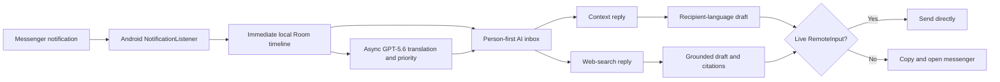

# ReplyHub - OpenAI Build Week Submission

## Tagline

One AI inbox for every conversation, language, and messenger on Android.

## Track

Apps for Your Life

## The problem

People who use several messengers lose time and context switching between apps. The problem becomes worse when a conversation is in another language: reading requires translation, answering may require searching the web, and remembering an address or commitment means scrolling through old messages. The result is delayed replies, avoidable misunderstandings, and missed deadlines.

## What ReplyHub does

ReplyHub turns Android messenger notifications into a private, conversation-first AI inbox:

- Groups notifications by stable room identity instead of presenting a noisy event feed or merging same-name senders.
- Shows the original message and an automatic Korean translation together.
- Identifies conversations that need a reply and surfaces urgent or foreign-language threads in an AI inbox.
- Lets users link the same person across different messengers into one chronological timeline, and uses the linked history when drafting.
- Uses GPT-5.6 to draft a reply in the recipient's language while preserving the relationship's polite or casual tone.
- Separates context-only replies from web-search replies. Search replies show clickable citations and can send source links to the recipient.
- Accepts Korean voice instructions for hands-free reply drafting.
- Offers a recording-safe demo mode that pauses live notification capture and restores deterministic judging scenarios.
- Sends only through an exact or unambiguous live Android RemoteInput action. Otherwise it copies the final reply, opens the correct app, and confirms whether it was sent before saving outgoing context.
- Provides per-messenger capture controls and 7/30/90-day or unlimited local retention.
- Searches installed launchable apps from the same search box without requesting `QUERY_ALL_PACKAGES`.

## Why the idea is different

ReplyHub is not a brittle clone of every messenger and does not pretend Android exposes private contact databases or permanent send APIs. It is a graceful AI coordination layer. It uses the information Android legitimately exposes, makes the most capable path obvious, and degrades to a safe copy-and-open flow when direct sending is unavailable.

The AI is part of the communication loop rather than a separate chatbot. Both sides benefit: the user gets translation, context retrieval, and web research; the recipient receives a natural reply and, when relevant, the supporting sources.

## Thoughtful use of GPT-5.6

1. **Notification enrichment:** a fast model returns strict structured output for language, Korean translation, and urgency.
2. **Contextual drafting:** GPT-5.6 receives the current message, recent incoming and outgoing messages, locally retrieved historical matches, current time, and detected relationship tone.
3. **Grounded search:** web mode requires the web-search tool, parses source metadata and URL annotations, and displays citations before sending.
4. **Recipient-language output:** strict JSON schema separates the recipient-ready answer, Korean meaning, tone, evidence, and tool used.
5. **Privacy controls:** Responses API requests use `store: false`; the user supplies an API key encrypted with Android Keystore, chooses capture apps, and controls retention.

## Product experience

## Technical implementation

- Kotlin and Jetpack Compose, Android 8.0+
- NotificationListenerService for supported messenger notifications
- Room for local message history and keyword retrieval
- OpenAI Responses API with GPT-5.6, strict Structured Outputs, and required web search
- Android SpeechRecognizer for Korean voice instructions
- Android RemoteInput and PendingIntent for direct replies
- Android Keystore AES/GCM for API-key storage
- Notification attachment extraction with a 20 MB local cap
- A catalog of 25 consumer and workplace messengers

## Built with Codex

Codex was used as an engineering collaborator throughout the project. It helped scaffold the Android notification spike, inspect real notification actions on a physical Samsung device, implement and test RemoteInput dispatch, design strict OpenAI response schemas, harden API-key storage, build the Compose conversation experience, and repeatedly run unit, lint, install, and device-level visual checks. Product feedback was also applied through Codex in short cycles: people-first grouping, outgoing-message history, attachment display, explicit search mode, editable drafts, installed-app search, smart triage, and unified contacts.

## Real-world limitations

- Android only; iOS does not expose an equivalent notification-listener API.
- Direct sending requires a currently active notification action with RemoteInput.
- Messenger-private contacts and old message databases are not exposed through a common Android API.
- Installed-app search lists launcher apps in the current Android profile, not hidden services or another work profile.
- ReplyHub does not use AccessibilityService to automate another app's UI.

## Potential impact

The initial audience is multilingual professionals, international families, students, and creators who already split communication across several messengers. ReplyHub can reduce missed urgent messages, shorten translation and research loops, and make cross-language communication feel like one continuous conversation without requiring every contact to change apps.

## User testing

Iterative sessions on a physical Samsung phone surfaced issues including sender-level grouping, same-name room ambiguity, missing outgoing context, ambiguous copy-and-open behavior, stale meaning after draft edits, unrelated draft details, relationship tone, source attribution, cross-app identity, privacy controls, and live-notification contamination during judging rehearsals. These were incorporated into the build. The direct-send path was also validated end to end with a live Android RemoteInput notification action.

## Suggested project gallery

1. `artifacts/screenshots/ai-inbox.png` - Person-first smart inbox with reply-needed, urgent, and foreign-language triage.
2. `artifacts/screenshots/unified-contact.png` - One chronological timeline combining WhatsApp and Telegram while preserving per-message source attribution.
3. `artifacts/screenshots/ai-draft.png` - Editable recipient-language draft with Korean meaning, relationship tone, evidence, and engine disclosure.

## Submission links

- Demo video: `ADD_URL`
- Public repository: `ADD_URL`
- Codex feedback/session reference: `ADD_REFERENCE`
